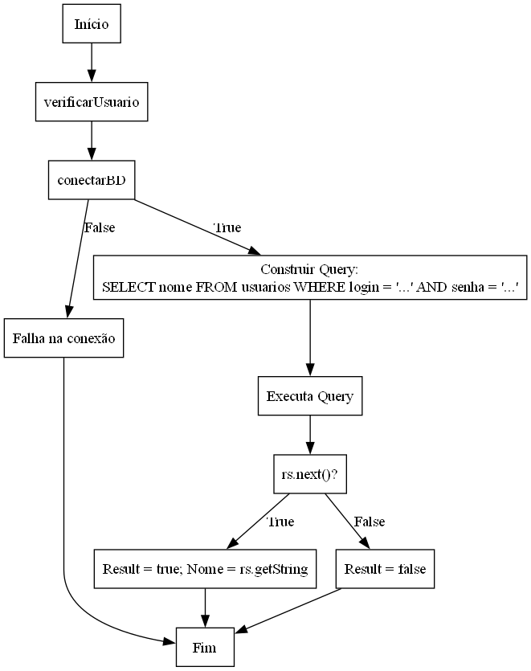

# testecaixabranca
Exercício individual de teste de caixa branca para a matéria de UI/UX, Profº Daniel Ohata

## ETAPA 1:
Apontar os erros encontrados no código:

### Em AuthenticationService:
* Falta de fechamento de conexão com o banco de dados;

* Falta de boa prática na escrita da string, o mais correto seria ""SELECT nome FROM usuarios WHERE login = ? AND senha = ?";

### Em DatabaseConnection:

* Nome do driver de conexão errado;

* Falta de feedback sobre o erro no console;

 * Falta tratamento de erros;

### Em User:

* A função de verificação de usuário também não existe, então não pode ser utilizada pelo main;
    
* Em nenhum momento há declaração da classe de senha, sendo assim, a clase main não conseguirá obter dados;

## ETAPA 3:

## Análise do Grafo de Fluxo

### Complexidade Ciclomática

- \(E = 11\): Número de arestas (conexões no grafo).
- \(N = 10\): Número de nós.
- \(P = 1\): Número de componentes conectados.

\[
V = 11 - 10 + 2 \times 1 = 3
\]

**Complexidade Ciclomática: \(V = 3\)**.

---

### Caminhos Básicos
São 3 caminhos básicos:

1. **1 (Conexão bem-sucedida e usuário válido)**:
   - Início → verificarUsuario → conectarBD (True) → Construir Query → Executa Query → rs.next()? (True) → Result = true → Fim.

2. **2 (Conexão bem-sucedida e usuário inválido)**:
   - Início → verificarUsuario → conectarBD (True) → Construir Query → Executa Query → rs.next()? (False) → Result = false → Fim.

3. **3 (Falha na conexão)**:
   - Início → verificarUsuario → conectarBD (False) → Falha na conexão → Fim.

## Etapa 4
Teste de Caixa Branca

Este é um repositório onde se encontra um projeto teste para realização de "Teste de caixa branca", sendo um sistema em Java para implementação de sistema de login com conexão a um banco de dados MySQL, com o objetivo de realizar uma análise estática do código, calculo de complexidade ciclomática e ainda a geração de documentação do código com a ferramenta Javadoc.

Objetivo 

O objetivo deste repositório é a realização das seguintes etapas:

* Análise Estática do Código: Examinando o código-fonte para identificão de problemas em potencial como falta de documentação, falta de boas práticas, ou erros de lógica.
* Cálculo da Complexidade Ciclomática: Avalia a complexidade do código com base em decisões e caminhos possíveis no fluxo do programa.
* Documentação com Javadoc: Geração de uma documentação técnica utilizando Javadoc para facilitar a compreensão do código, descrevendo as classes, métodos e variáveis utilizadas no sistema.
* Testes de Caixa Branca: Realizar testes garantindo a cobertura de código, análise de loops, condições de parada e tratamento de exceções.

Estrutura do Projeto

O projeto está organizado da seguinte forma:

Código

*O código consiste em uma classe Java que realiza a verificação de usuários em um banco de dados MySQL. Ele possui uma requisição de conexão ao banco de dados e verifica se o login e senha fornecidos são válidos, retornando o nome do usuário caso a autenticação seja bem-sucedida.

Testes

O projeto inclui os seguintes tipos de testes:

    *Testes de Verificação de Erros: Análise de falhas e problemas no código, como falta de tratamento de exceções e erros lógicos.
    *Cálculo da Complexidade Ciclomática: Cálculo realizado para avaliar o número de decisões e caminhos possíveis no código, com o objetivo de identificar a complexidade do fluxo de execução.
    *Testes de Caixa Branca: Testes para validação da cobertura de código, condição de loops e integridade do tratamento de exceções.

Etapas Realizadas
1. Análise Estática do Código

Foi feita uma análise estática no código, onde foram verificados possíveis problemas como:

    *Falta de documentação no código.
    Uso inadequado de estruturas de controle (por exemplo, loops infinitos ou condições sem verificação).
    *Arquitetura do código, identificando problemas relacionados à abertura de conexões com o banco de dados fora da camada apropriada.

2. Cálculo da Complexidade Ciclomática

Foi realizada a análise de complexidade ciclomática do código, identificando o número de caminhos possíveis através das decisões condicionais e laços de repetição no código. O objetivo é avaliar a complexidade do sistema e melhorar a manutenção futura.

3. Geração da Documentação Javadoc

Utilizando a ferramenta Javadoc, foi criada uma documentação para fornecer uma descrição clara e objetiva das classes, métodos e variáveis.

4. Testes de Caixa Branca

Foram realizados os testes para verificação da cobertura de código e suas possíveis falhas no sistema.

    *Cobertura de Código: Garantir que todas as partes do código estejam sendo executadas
    *Condições de Loop: Verificar se todos os loops têm uma condição de parada.
    Tratamento de Exceções: Certificar-se de que todas as exceções tenham tratamento.
